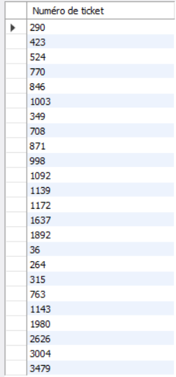

# Exercice 1

## Enoncé

1. Quels sont les tickets qui comportent l’article d’ID 500, afficher le numéro de ticket
uniquement ?

## Requête

``` sql
SELECT ventes.NUMERO_TICKET AS "Numéro de ticket"
FROM ventes
WHERE ventes.ID_ARTICLE = "500"
```

## Capture

Voici le résultat de la requête:



## Remarques
Aucune