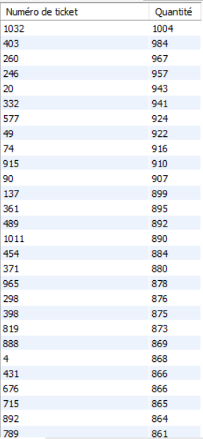

# Exercice 10

## Enoncé

Lister pour chaque ticket la quantité totale d’articles vendus. (Classer par quantité
décroissante)

## Requête

``` sql
SELECT 
    ventes.NUMERO_TICKET AS 'Numéro de ticket',
    SUM(QUANTITE) AS 'Quantité'
FROM
    VENTES
GROUP BY ventes.NUMERO_TICKET
ORDER BY SUM(QUANTITE) DESC
```

## Capture

Voici le résultat de la requête:



## Remarques
Aucune