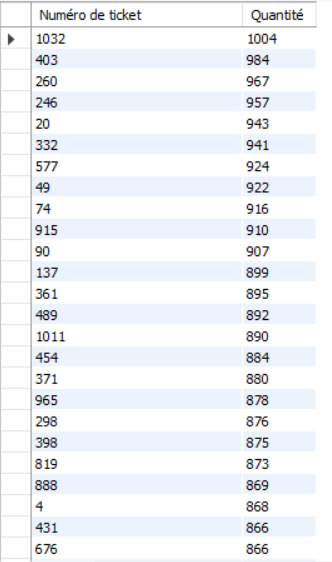

# Exercice 11

## Enoncé

Lister chaque ticket pour lequel la quantité totale d’articles vendus est supérieure à
500. (Classer par quantité décroissante)

## Requête

``` sql
SELECT 
    ventes.NUMERO_TICKET AS 'Numéro de ticket',
    SUM(QUANTITE) AS 'Quantité'
FROM
    VENTES
GROUP BY ventes.NUMERO_TICKET
HAVING SUM(QUANTITE) > 500
ORDER BY SUM(QUANTITE) DESC
```

## Capture

Voici le résultat de la requête:



## Remarques
Aucune