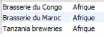

# Exercice 14

## Enoncé

Lister les marques de bières du continent ‘Afrique’

## Requête

``` sql
SELECT 
    marque.NOM_MARQUE, continent.NOM_CONTINENT
FROM
    pays
        LEFT JOIN
    marque ON marque.ID_PAYS = pays.ID_PAYS
        LEFT JOIN
    continent ON continent.ID_CONTINENT = pays.ID_CONTINENT
WHERE
    continent.NOM_CONTINENT = 'Afrique'

```

## Capture

Voici le résultat de la requête:



## Remarques
Aucune