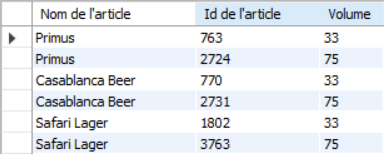

# Exercice 15

## Enoncé

Lister les bières du continent ‘Afrique’

## Requête

``` sql
SELECT 
    article.NOM_ARTICLE AS 'Nom de l\'article',
    article.ID_ARTICLE AS 'Id de l\'article',
    article.VOLUME AS 'Volume'
FROM
    article
        JOIN
    marque ON article.ID_MARQUE = marque.ID_MARQUE
        JOIN
    pays ON marque.ID_PAYS = pays.ID_PAYS
        JOIN
    continent ON continent.ID_CONTINENT = pays.ID_CONTINENT
WHERE
    continent.NOM_CONTINENT = 'Afrique'

```

## Capture

Voici le résultat de la requête:



## Remarques
Aucune