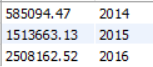

# Exercice 17

## Enoncé

Donner le C.A. par année.

## Requête

``` sql
SELECT 
    ROUND(SUM(article.PRIX_ACHAT * ventes.QUANTITE * 1.15),
            2) AS 'Montant',
    ventes.ANNEE AS 'Année'
FROM
    article
        JOIN
    ventes ON article.ID_ARTICLE = ventes.ID_ARTICLE
GROUP BY ventes.ANNEE

```

## Capture

Voici le résultat de la requête:



## Remarques
Aucune