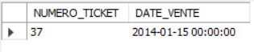

# Exercice 3

## Enoncé

Afficher les tickets du 15/01/2014.

## Requête

``` sql
SELECT 
    ticket.DATE_VENTE
FROM
    ticket
WHERE
    DATE_VENTE = '2015-01-15'
```

## Capture

Voici le résultat de la requête:



## Remarques
Aucune