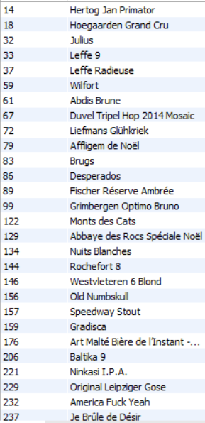

# Exercice 20

## Enoncé

Lister les articles qui n’ont fait l’objet d’aucune vente en 2014.

## Requête

``` sql
SELECT 
    article.ID_ARTICLE, article.NOM_ARTICLE
FROM
    article
WHERE
    article.ID_ARTICLE NOT IN (SELECT 
            id_article
        FROM
            ventes
        WHERE
            ANNEE = '2014'
        GROUP BY ventes.ID_ARTICLE)

```

## Capture

Voici le résultat de la requête:



## Remarques
Aucune