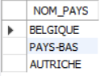

# Exercice 21

## Enoncé

Coder de 3 manières différentes la requête suivante : Lister les pays qui fabriquent des bières de type ‘Trappiste’.

## Requête1

``` sql
SELECT 
    pays.NOM_PAYS
FROM
    pays
WHERE
    ID_PAYS IN (SELECT DISTINCT
            (marque.ID_PAYS)
        FROM
            marque
        WHERE
            ID_MARQUE IN (SELECT DISTINCT
                    (id_marque)
                FROM
                    article
                WHERE
                    article.ID_TYPE IN (SELECT 
                            ID_TYPE
                        FROM
                            type
                        WHERE
                            NOM_TYPE = 'Trappiste')))

```
## Requête2

``` sql
SELECT DISTINCT
    (pays.NOM_PAYS)
FROM
    pays
        JOIN
    marque ON pays.ID_PAYS = marque.ID_PAYS
        JOIN
    article ON marque.ID_MARQUE = article.ID_MARQUE
        JOIN
    type ON article.ID_TYPE = type.ID_TYPE
WHERE
    type.NOM_TYPE = 'Trappiste'
``` 
## Capture

Voici le résultat de la requête:



## Remarques
Aucune