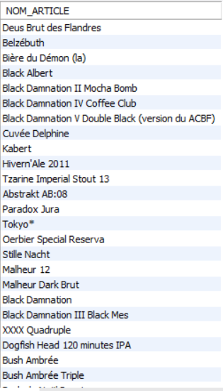

# Exercice 23

## Enoncé

Lister les articles ayant un degré d’alcool plus élevé que la plus forte des trappistes.

## Requête

``` sql
SELECT 
    article.NOM_ARTICLE
FROM
    article
WHERE
    article.TITRAGE > (SELECT 
            MAX(article.TITRAGE) AS 'Degrès Max Trappiste'
        FROM
            article
        WHERE
            article.ID_TYPE = (SELECT 
                    type.ID_TYPE
                FROM
                    type
                WHERE
                    type.NOM_TYPE = 'Trappiste'))

```

## Capture

Voici le résultat de la requête:



## Remarques
Aucune