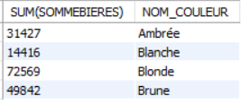

# Exercice 24

## Enoncé

Editer les quantités vendues pour chaque couleur en 2014.

## Requête

``` sql
SELECT 
    SUM(SOMMEBIERES), NOM_COULEUR
FROM
    (SELECT 
        NOM_COULEUR, a.ID_ARTICLE
    FROM
        couleur c, article a
    WHERE
        a.ID_Couleur = c.ID_Couleur) cl,
    (SELECT 
        SUM(QUANTITE) AS SOMMEBIERES, a.ID_ARTICLE
    FROM
        ventes v, article a
    WHERE
        v.ANNEE = '2014'
            AND v.id_article = a.id_article
    GROUP BY ID_ARTICLE) ve
WHERE
    cl.ID_ARTICLE = ve.ID_ARTICLE
GROUP BY NOM_COULEUR;

```

## Capture

Voici le résultat de la requête:



## Remarques
Aucune