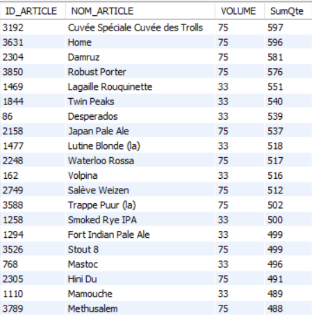

# Exercice 26

## Enoncé

Donner l’ID, le nom, le volume et la quantité vendue des 20 articles les plus vendus en 2016.

## Requête

``` sql
SELECT 
    art_nom_vol.ID_ARTICLE,
    art_nom_vol.NOM_ARTICLE,
    art_nom_vol.VOLUME,
    qte.SumQte
FROM
    (SELECT 
        ID_ARTICLE, article.NOM_ARTICLE, article.VOLUME
    FROM
        article) art_nom_vol,
    (SELECT 
        ventes.ID_ARTICLE, SUM(ventes.QUANTITE) AS SumQte
    FROM
        ventes
    WHERE
        ANNEE = '2016'
    GROUP BY ID_ARTICLE) qte
WHERE
    art_nom_vol.ID_ARTICLE = qte.ID_ARTICLE
ORDER BY sumQte DESC
LIMIT 20
```

## Capture

Voici le résultat de la requête:



## Remarques
Aucune