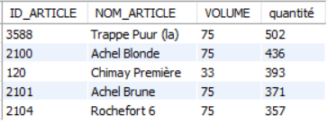

# Exercice 27

## Enoncé

Donner l’ID, le nom, le volume et la quantité vendue des 5 ‘Trappistes’ les plus vendus en 2016.

## Requête

``` sql
SELECT 
    art_qte.ID_ARTICLE,
    NOM_ARTICLE,
    VOLUME,
    SUM(QUANTITE) AS quantité
FROM
    (SELECT 
        ID_ARTICLE, QUANTITE
    FROM
        ventes
    WHERE
        ANNEE = '2016') art_qte,
    (SELECT 
        ID_ARTICLE, NOM_ARTICLE, VOLUME
    FROM
        article
    WHERE
        ID_TYPE IN (SELECT 
                ID_TYPE
            FROM
                type
            WHERE
                NOM_TYPE = 'Trappiste')) tab_trap
WHERE
    art_qte.ID_ARTICLE = tab_trap.ID_ARTICLE
GROUP BY ID_ARTICLE
ORDER BY quantité DESC
LIMIT 5;
```

## Capture

Voici le résultat de la requête:



## Remarques
Aucune