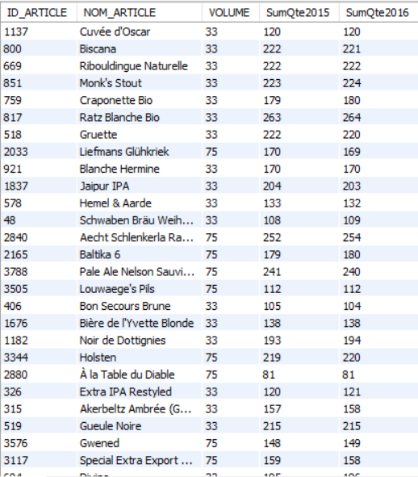

# Exercice 28

## Enoncé

Donner l’ID, le nom, le volume et les quantités vendues en 2015 et 2016, des bières dont les ventes ont été stables. ( Moins de 1% de variation)

## Requête

``` sql
-- Taux de variation = (Valeur d’arrivée - Valeur de départ) ÷ Valeur de départ × 100
SELECT 
    ventes2015.ID_ARTICLE,
    ventes2015.NOM_ARTICLE,
    ventes2015.VOLUME,
    ventes2015.SumQte2015,
    ventes2016.SumQte2016
FROM
    (SELECT 
        art_nom_vol.ID_ARTICLE,
            art_nom_vol.NOM_ARTICLE,
            art_nom_vol.VOLUME,
            qte.SumQte2015
    FROM
        (SELECT 
        ID_ARTICLE, article.NOM_ARTICLE, article.VOLUME
    FROM
        article) art_nom_vol, (SELECT 
        ventes.ID_ARTICLE, SUM(ventes.QUANTITE) AS SumQte2015
    FROM
        ventes
    WHERE
        ANNEE = '2015'
    GROUP BY ID_ARTICLE) qte
    WHERE
        art_nom_vol.ID_ARTICLE = qte.ID_ARTICLE
    ORDER BY SumQte2015) ventes2015,
    (SELECT 
        art_nom_vol.ID_ARTICLE,
            art_nom_vol.NOM_ARTICLE,
            art_nom_vol.VOLUME,
            qte.SumQte2016
    FROM
        (SELECT 
        ID_ARTICLE, article.NOM_ARTICLE, article.VOLUME
    FROM
        article) art_nom_vol, (SELECT 
        ventes.ID_ARTICLE, SUM(ventes.QUANTITE) AS SumQte2016
    FROM
        ventes
    WHERE
        ANNEE = '2016'
    GROUP BY ID_ARTICLE) qte
    WHERE
        art_nom_vol.ID_ARTICLE = qte.ID_ARTICLE
    ORDER BY SumQte2016) ventes2016
WHERE
    ventes2015.ID_ARTICLE = ventes2016.ID_ARTICLE
        AND ABS((ventes2016.SumQte2016 - ventes2015.SumQte2015) / ventes2015.SumQte2015 * 100) < 1
```

## Capture

Voici le résultat de la requête:



## Remarques
Aucune