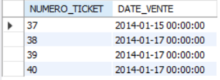

# Exercice 3

## Enoncé

Afficher les tickets émis du 15/01/2014 et le 17/01/2014.

## Requête

``` sql
SELECT 
    ticket.NUMERO_TICKET, ticket.DATE_VENTE
FROM
    ticket
WHERE
    DATE_VENTE BETWEEN '2014-01-15' AND '2014-01-17'
```

## Capture

Voici le résultat de la requête:



## Remarques
Aucune