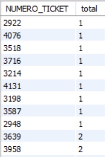

# Exercice 30

## Enoncé

Existe t il des tickets sans vente ?

## Requête

``` sql
select NUMERO_TICKET, count(ID_ARTICLE) as total from ventes group by NUMERO_TICKET
order by total;
```

## Capture

Voici le résultat de la requête:



## Remarques
Je ne sais pas si j'ai bien compris la question. Dans la mesure ou il y a au moins un article par ticket, je dirai que non...