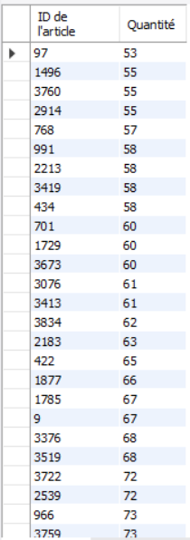

# Exercice 4

## Enoncé

Editer la liste des articles apparaissant
à 50 et plus exemplaires sur un ticket.

## Requête

``` sql
SELECT 
    ID_ARTICLE AS 'ID de l\'article', QUANTITE AS ' Quantité'
FROM
    ventes
WHERE
    QUANTITE > 50
    
order by QUANTITE
```

## Capture

Voici le résultat de la requête:



## Remarques
Aucune