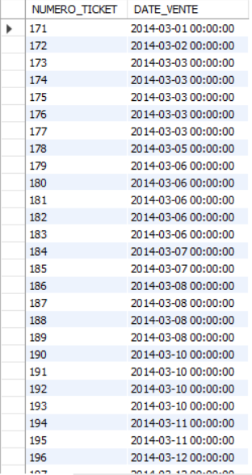

# Exercice 5

## Enoncé

5. Quelles sont les tickets émis au mois de mars 2014.

## Requête

``` sql
SELECT 
    ticket.NUMERO_TICKET, ticket.DATE_VENTE
FROM
    ticket
WHERE
    MONTH(DATE_VENTE) = 03
        AND YEAR(DATE_VENTE) = 2014
```

## Capture

Voici le résultat de la requête:



## Remarques
Aucune