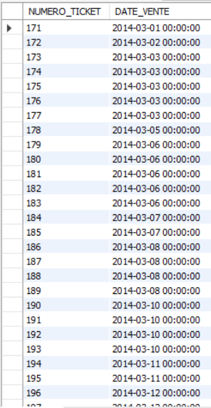

# Exercice 6

## Enoncé

6. Quelles sont les tickets émis entre les mois de mars et avril 2014 ?

## Requête

``` sql
SELECT 
    ticket.NUMERO_TICKET, ticket.DATE_VENTE
FROM
    ticket
WHERE
    (MONTH(DATE_VENTE) BETWEEN 03 AND 04)
        AND YEAR(DATE_VENTE) = 2014
```

## Capture

Voici le résultat de la requête:



## Remarques
Aucune