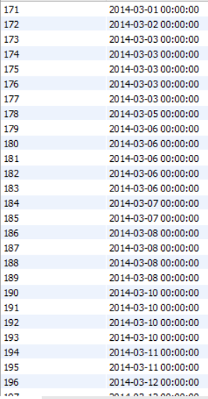

# Exercice 7

## Enoncé

Quelles sont les tickets émis au mois de mars et juin 2014 ?

## Requête

``` sql
SELECT ticket.NUMERO_TICKET as "Numéro de ticket",
	ticket.DATE_VENTE as "Date de vente"
    from 
    ticket
    WHERE
    (month(DATE_VENTE) = 3 OR month(DATE_VENTE) = 4)
    and
    year(DATE_VENTE) = 2014
```

## Capture

Voici le résultat de la requête:



## Remarques
Aucune