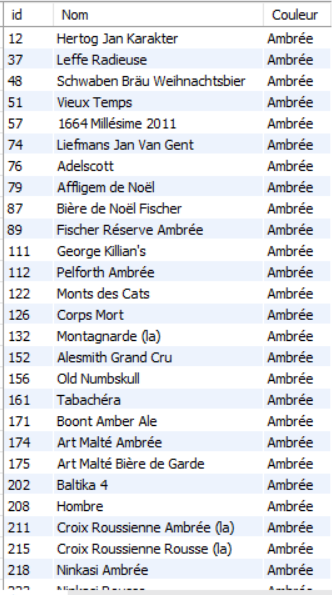

# Exercice 8

## Enoncé

Afficher la
liste des bières classée par couleur. ( A fficher l’id et le nom)

## Requête

``` sql
SELECT 
    article.ID_ARTICLE AS 'id',
    article.NOM_ARTICLE AS 'Nom',
    couleur.NOM_COULEUR AS 'Couleur'
FROM
    article
        INNER JOIN
    couleur ON article.ID_Couleur = couleur.ID_Couleur
ORDER BY NOM_COULEUR

```

## Capture

Voici le résultat de la requête:



## Remarques
Aucune