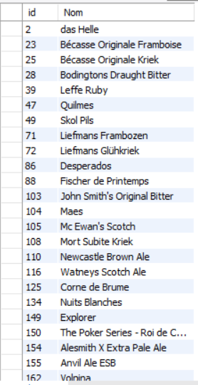

# Exercice 9

## Enoncé

Afficher la liste des bières n’ayant pas de couleur. (
Afficher l’id et le nom)

## Requête

``` sql
SELECT 
    article.ID_ARTICLE AS 'id',
    article.NOM_ARTICLE AS 'Nom'
FROM
    article
        LEFT JOIN
    couleur ON article.ID_Couleur = couleur.ID_Couleur
    WHERE couleur.NOM_COULEUR IS null

```

## Capture

Voici le résultat de la requête:



## Remarques
Aucune